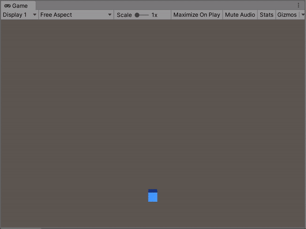
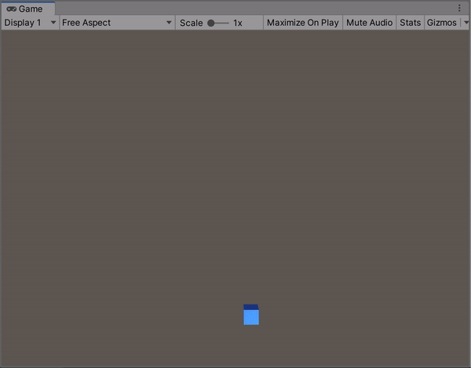
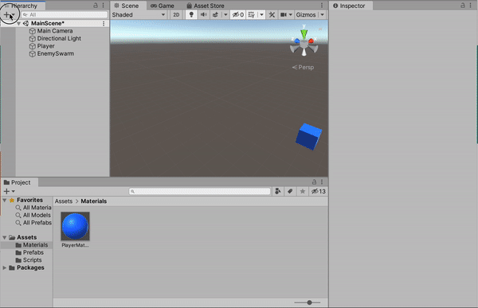
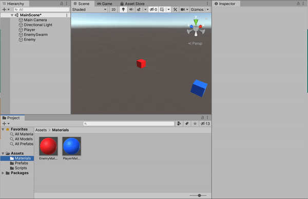
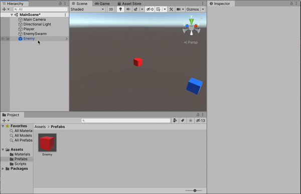
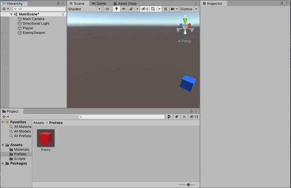
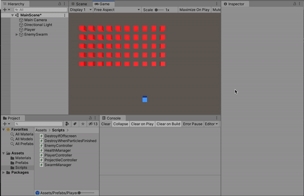
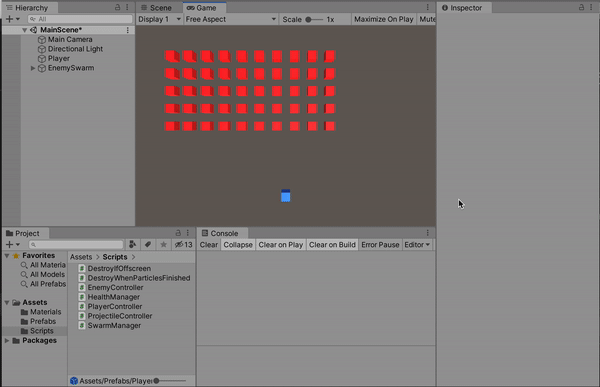
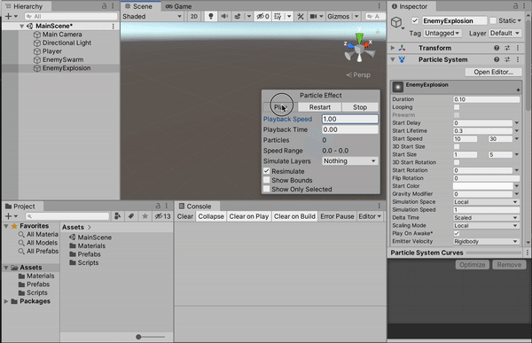

**The University of Melbourne**
# COMP30019 – Graphics and Interaction

## Workshop 8

# Introduction:

In this lab you will be constructing the beginnings of a simple space invaders game in Unity. In particular you will learn more about the component based system offered by Unity, and how it can be used to put together interactive applications rapidly. The game will be represented in a 3D world, but will be viewed from a top-down view (in the classic space invaders style). Ultimately this means all objects will be assumed to have a y-position of 0.

  

# Task:

1. Open `MainScene.unity` in Unity. Press the ‘Play’ button. You’ll notice that a ‘player ship’ is at the bottom of the screen, and can move left and right when you press the respective arrow keys.

  

2. Create an enemy game object. Make sure it is rendered differently to the player (at least a different colour). At this stage it will not do anything when the game is run.

  

3. Create a `prefab` from the enemy object you created. This will allow it to be instantiated so you can place many identical enemies in the scene. Additionally, if a modification is made directly to the prefab, then every instance of it will automatically reflect the modification.

  

4. Delete the enemy object (not the prefab) from the scene. Note that because you created a prefab asset from the enemy, the “template” to produce enemies is still there. We will now write a script to instantiate a swarm of enemies and bring them to life.

  

a. Open the script called `SwarmManager.cs`. Note that it is currently attached to the ‘EnemySwarm’ game object.

b. Complete the `GenerateSwarm()` method in `SwarmManager.cs`. The method should instantiate a swarm of enemies in a “grid” formation. Make use of the public attributes to determine the number of rows and columns the grid of enemies comprises of, as well as the spacing between enemies. **Tip:** It will be a good idea to make the enemies children of the swarm script game object. This way, transforming the swarm object will transform all the enemies together.

c. Complete the `StepSwarm()` method in `SwarmManager.cs`. This method should move all the enemies across the screen one step. If the enemy swarm has reached the edge of the playing area, the enemies should move down one step and reverse their stepping direction (like classic space invaders). Note that the `Update()` method is already implemented to call `StepSwarm()` every stepTime seconds.

  

5. Create a new prefab which represents a player projectile. Pressing ‘Space’ should fire a projectile instance upwards towards the enemy swarm. If the projectile collides with an enemy, the enemy should be destroyed as well as the projectile itself. Ensure that projectiles which miss and fly off the screen are eventually destroyed (to prevent a ‘leak’).

  

6. Modify the game such that the enemies have health, and so aren’t destroyed by just one projectile. Enemies should change visually in some way to reflect the loss in health (i.e. darken in colour).

  

7. Using a particle system, generate an ‘explosion’ effect that is triggered when an enemy is destroyed. Ensure the explosions are randomly varied in some way from enemy to enemy.

  

8. **Extension** Consider a game whereby there are hundreds or even thousands of entities created and/or destroyed each second (i.e. lots of projectiles). Sometimes it is worth utilising “object pools” to recycle objects rather than continually instantiate and destroy them. Research techniques for doing so and perhaps try to implement an object pool for the projectiles presently implemented in the game.
